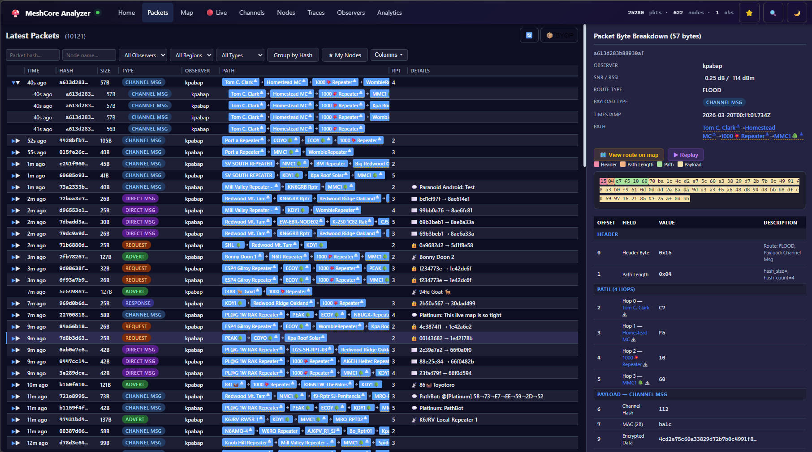
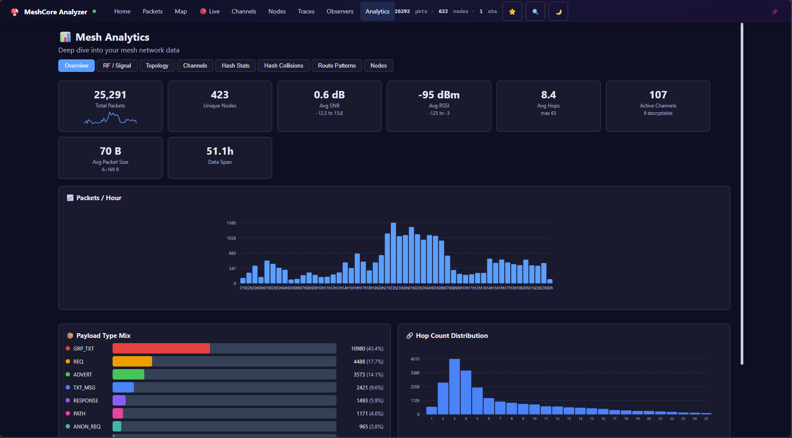
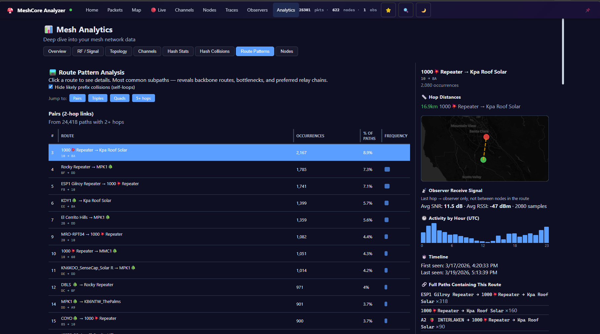
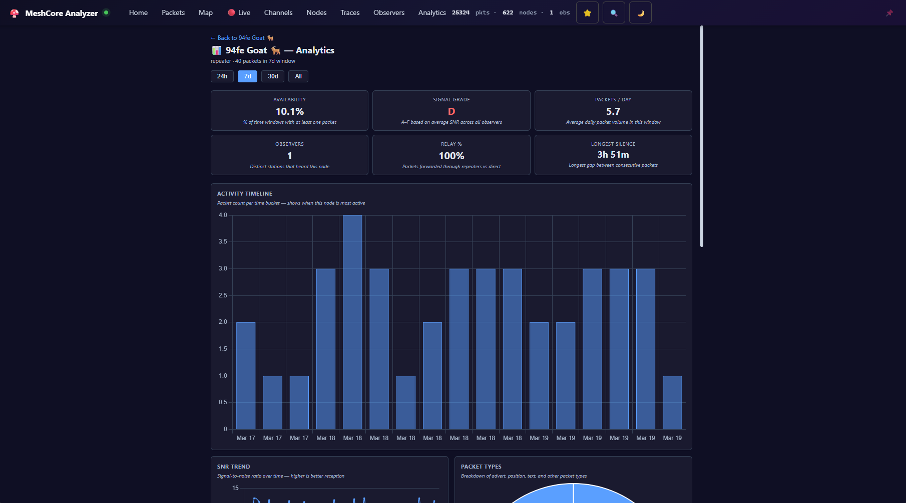
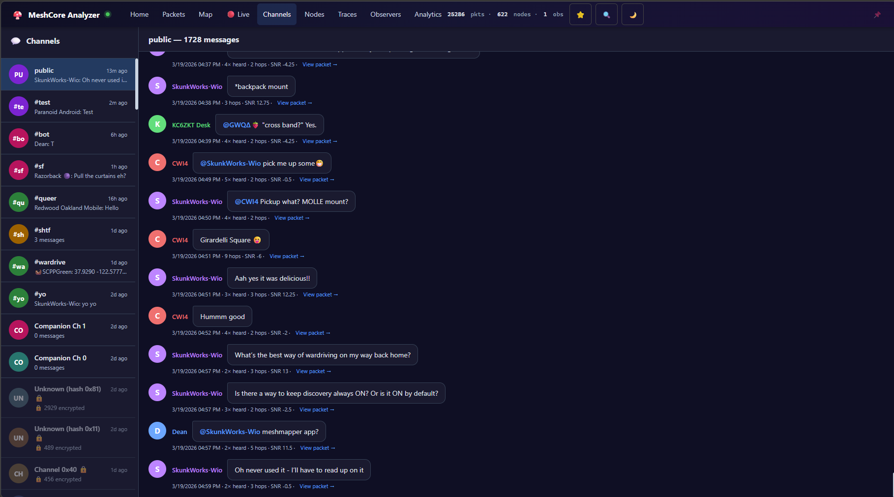
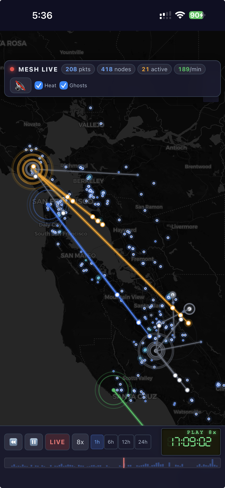

# MeshCore Analyzer

[](https://github.com/Kpa-clawbot/meshcore-analyzer/actions/workflows/deploy.yml)
[](https://github.com/Kpa-clawbot/meshcore-analyzer/actions/workflows/deploy.yml)
[](https://github.com/Kpa-clawbot/meshcore-analyzer/actions/workflows/deploy.yml)
[](https://github.com/Kpa-clawbot/meshcore-analyzer/actions/workflows/deploy.yml)
[](https://github.com/Kpa-clawbot/meshcore-analyzer/actions/workflows/deploy.yml)

> Self-hosted, open-source MeshCore packet analyzer — a community alternative to the closed-source `analyzer.letsmesh.net`.

Collects MeshCore packets via MQTT, decodes them, and presents a full web UI with live packet feed, node map, channel chat, packet tracing, per-node analytics, and more.

## ✨ Features

### 📡 Live Trace Map
Real-time animated map with packet route visualization, VCR-style playback controls, and a retro LCD clock. Replay the last 24 hours of mesh activity, scrub through the timeline, or watch packets flow live at up to 4× speed.


### 📦 Packet Feed
Filterable real-time packet stream with byte-level breakdown, Excel-like resizable columns, and a detail pane. Toggle "My Nodes" to focus on your mesh.



### 🗺️ Network Overview
At-a-glance mesh stats — node counts, packet volume, observer coverage.



### 🔀 Route Patterns
Visualize how packets traverse the mesh — see which repeaters carry the most traffic and identify routing patterns.



### 📊 Node Analytics
Per-node deep dive with 6 interactive charts: activity timeline, packet type breakdown, SNR distribution, hop count analysis, peer network graph, and hourly heatmap.



### 💬 Channel Chat
Decoded group messages with sender names, @mentions, timestamps — like reading a Discord channel for your mesh.



### 📱 Mobile Ready
Full experience on your phone — proper touch controls, iOS safe area support, and a compact VCR bar that doesn't fight your thumb.



### And More

- **Node Directory** — searchable list with role tabs, detail panel, QR codes, advert timeline, "Heard By" observer table
- **Packet Tracing** — follow individual packets across observers with SNR/RSSI timeline
- **Observer Status** — health monitoring, packet counts, uptime
- **Hash Collision Matrix** — detect address collisions across the mesh
- **Claimed Nodes** — star your nodes, always sorted to top, visual distinction
- **Dark / Light Mode** — auto-detects system preference, instant toggle, map tiles swap too
- **Multi-Broker MQTT** — connect to multiple MQTT brokers simultaneously with per-source IATA filtering
- **Observer Detail Pages** — click any observer for analytics, charts, status, radio info, recent packets
- **Channel Key Auto-Derivation** — hashtag channels (`#channel`) keys derived automatically via SHA256
- **Global Search** — search packets, nodes, and channels (Ctrl+K)
- **Shareable URLs** — deep links to individual packets, channels, and observer detail pages
- **Mobile Responsive** — proper two-row VCR bar, iOS safe area support, touch-friendly
- **Accessible** — ARIA patterns, keyboard navigation, screen reader support, distinct marker shapes

### ⚡ Performance (v2.1.1)

Two-layer caching architecture: in-memory packet store + TTL response cache. All packet reads served from RAM — SQLite is write-only. Heavy endpoints pre-warmed on startup.

| Endpoint | Before | After | Speedup |
|---|---|---|---|
| Bulk Health | 7,059 ms | 1 ms | **7,059×** |
| Node Analytics | 381 ms | 1 ms | **381×** |
| Topology | 685 ms | 2 ms | **342×** |
| Node Health | 195 ms | 1 ms | **195×** |
| Node Detail | 133 ms | 1 ms | **133×** |

See [PERFORMANCE.md](PERFORMANCE.md) for the full benchmark.

## Quick Start

### Docker (Recommended)

The easiest way to run MeshCore Analyzer. Includes Mosquitto MQTT broker — everything in one container.

```bash
docker build -t meshcore-analyzer .
docker run -d \
  --name meshcore-analyzer \
  -p 80:80 \
  -p 443:443 \
  -p 1883:1883 \
  -v meshcore-data:/app/data \
  -v caddy-certs:/data/caddy \
  meshcore-analyzer
```

Open `http://localhost`. Point your MeshCore gateway's MQTT to `<host-ip>:1883`.

**With a domain (automatic HTTPS):**
```bash
# Create a Caddyfile with your domain
echo 'analyzer.example.com { reverse_proxy localhost:3000 }' > Caddyfile

docker run -d \
  --name meshcore-analyzer \
  -p 80:80 \
  -p 443:443 \
  -p 1883:1883 \
  -v meshcore-data:/app/data \
  -v caddy-certs:/data/caddy \
  -v $(pwd)/Caddyfile:/etc/caddy/Caddyfile \
  meshcore-analyzer
```

Caddy automatically provisions Let's Encrypt TLS certificates.

**Custom config:**
```bash
# Copy and edit the example config
cp config.example.json config.json
# Edit config.json with your channel keys, regions, etc.

docker run -d \
  --name meshcore-analyzer \
  -p 3000:3000 \
  -p 1883:1883 \
  -v meshcore-data:/app/data \
  meshcore-analyzer
```

Config lives in the data volume at `/app/data/config.json` — a default is created on first run. To edit it:
```bash
docker exec -it meshcore-analyzer vi /app/data/config.json
```

Or use a bind mount for the data directory:
```bash
docker run -d \
  --name meshcore-analyzer \
  -p 3000:3000 \
  -p 1883:1883 \
  -v ./data:/app/data \
  meshcore-analyzer
# Now edit ./data/config.json directly on the host
```

**Theme customization:** Put `theme.json` next to `config.json` — wherever your config lives, that's where the theme goes. Use the built-in customizer (Tools → Customize) to design your theme, download the file, and drop it in. Changes are picked up on page refresh — no restart needed. The server logs where it's looking on startup.

### Manual Install

#### Prerequisites

- **Node.js** 18+ (tested with 22.x)
- **MQTT broker** (Mosquitto recommended) — optional, can inject packets via API

### Install

```bash
git clone https://github.com/Kpa-clawbot/meshcore-analyzer.git
cd meshcore-analyzer
npm install
```

### Configure

Edit `config.json`:

```json
{
  "port": 3000,
  "https": {
    "cert": "/path/to/cert.pem",
    "key": "/path/to/key.pem"
  },
  "mqtt": {
    "broker": "mqtt://localhost:1883",
    "topic": "meshcore/+/+/packets"
  },
  "mqttSources": [
    {
      "name": "remote-feed",
      "broker": "mqtts://remote-broker:8883",
      "topics": ["meshcore/+/+/packets", "meshcore/+/+/status"],
      "username": "user",
      "password": "pass",
      "rejectUnauthorized": false,
      "iataFilter": ["SJC", "SFO", "OAK"]
    }
  ],
  "channelKeys": {
    "public": "8b3387e9c5cdea6ac9e5edbaa115cd72"
  },
  "defaultRegion": "SJC",
  "regions": {
    "SJC": "San Jose, US",
    "SFO": "San Francisco, US",
    "OAK": "Oakland, US"
  }
}
```

| Field | Description |
|-------|-------------|
| `port` | HTTP server port (default: 3000) |
| `https.cert` / `https.key` | Optional PEM cert/key paths to enable native HTTPS (falls back to HTTP if omitted or unreadable) |
| `mqtt.broker` | Local MQTT broker URL. Set to `""` to disable |
| `mqtt.topic` | MQTT topic pattern for packet ingestion |
| `mqttSources` | Array of external MQTT broker connections (optional) |
| `mqttSources[].name` | Friendly name for logging |
| `mqttSources[].broker` | Broker URL (`mqtt://` or `mqtts://` for TLS) |
| `mqttSources[].topics` | Array of MQTT topic patterns to subscribe to |
| `mqttSources[].username` / `password` | Broker credentials |
| `mqttSources[].rejectUnauthorized` | Set `false` for self-signed TLS certs |
| `mqttSources[].iataFilter` | Only accept packets from these IATA regions |
| `channelKeys` | Named channel decryption keys (hex). Hashtag channels auto-derived via SHA256 |
| `defaultRegion` | Default IATA region code for the UI |
| `regions` | Map of IATA codes to human-readable region names |

### Run

```bash
node server.js
```

Open `http://localhost:3000` in your browser.

### Environment Variables

| Variable | Description |
|----------|-------------|
| `PORT` | Override config.json port |
| `DB_PATH` | Override SQLite database path (default: `data/meshcore.db`) |

### Generate Test Data

```bash
# Generate and inject 200 packets via API
node tools/generate-packets.js --api --count 200

# Or output as JSON
node tools/generate-packets.js --json --count 50
```

### Run Tests

```bash
# End-to-end test
DB_PATH=/tmp/test-e2e.db PORT=13590 node tools/e2e-test.js

# Frontend smoke test
DB_PATH=/tmp/test-fe.db PORT=13591 node tools/frontend-test.js
```

## MQTT Setup

MeshCore packets flow into the analyzer via MQTT:

1. **Flash an observer node** with `MESH_PACKET_LOGGING=1` build flag
2. **Connect via USB** to a host running [meshcoretomqtt](https://github.com/Cisien/meshcoretomqtt)
3. **Configure meshcoretomqtt** with your IATA region code and MQTT broker address
4. **Packets appear** on topic `meshcore/{IATA}/{PUBKEY}/packets`

Alternatively, POST raw hex packets to `POST /api/packets` for manual injection.

## Architecture

```
Observer Node → USB → meshcoretomqtt → MQTT Broker → Analyzer Server → WebSocket → Browser
                                                    → SQLite DB
                                                    → REST API
```

## Project Structure

```
meshcore-analyzer/
├── Dockerfile           # Single-container build (Node + Mosquitto + Caddy)
├── .dockerignore
├── config.example.json  # Example config (copy to config.json)
├── config.json          # MQTT, channel keys, regions (gitignored)
├── server.js            # Express + WebSocket + MQTT + REST API
├── decoder.js           # Custom MeshCore packet decoder
├── db.js                # SQLite schema + queries
├── packet-store.js      # In-memory packet store (ring buffer, indexed)
├── docker/
│   ├── supervisord.conf # Process manager config
│   ├── mosquitto.conf   # MQTT broker config
│   ├── Caddyfile        # Default Caddy config (localhost)
│   └── entrypoint.sh    # Container entrypoint
├── data/
│   └── meshcore.db      # Packet database (auto-created)
├── public/
│   ├── index.html       # SPA shell
│   ├── style.css        # Theme (light/dark)
│   ├── app.js           # Router, WebSocket, utilities
│   ├── packets.js       # Packet feed + byte breakdown + detail page
│   ├── map.js           # Leaflet map with route visualization
│   ├── live.js          # Live trace page with VCR playback
│   ├── channels.js      # Channel chat
│   ├── nodes.js         # Node directory + detail views
│   ├── analytics.js     # Global analytics dashboard
│   ├── node-analytics.js # Per-node analytics with charts
│   ├── traces.js        # Packet tracing
│   ├── observers.js     # Observer status
│   ├── observer-detail.js # Observer detail with analytics
│   ├── home.js          # Dashboard home page
│   └── perf.js          # Performance monitoring dashboard
└── tools/
    ├── generate-packets.js  # Synthetic packet generator
    ├── e2e-test.js          # End-to-end API tests
    └── frontend-test.js     # Frontend smoke tests
```

## Changelog

### [Unreleased] — post-v2.6.0

- **Responsive design** — layout improvements across all screen sizes
- **Auto-linkify URLs** in channel messages — links open in a new tab
- **Channel colors** — HSL golden-angle algorithm replaces palette-based colors, eliminating collisions; unread dot color matches channel badge
- **Sender avatar colors** — toned down with darker border ring for readability
- **Pulsing unread dot** — subtle animation on channel list when a new message arrives
- **Analytics improvements** — packets/hour chart, payload type colors, RF analytics fixes
- **UNK payload types** — all `UNK*` variants merged into a single `UNK` row in analytics
- **Map lock/unlock** — prevent accidental map panning; back buttons on map detail views
- **Path graph** — fits container on load, zooms on hover/touch
- **Full-page packet detail** — redesigned layout with proper scroll, responsive columns, equal-height cards, and inline Packet Trace section
- **Location anonymization** — configurable option to hide precise GPS coordinates
- **Packet detail location** — shows GPS for ADVERTs, sender node lookup for channel texts
- **Map link from packet detail** — 📍 navigates to `#/map?node=PUBKEY`, centers and opens popup
- **Observer IATA regions** — displayed in packet detail, node detail, and live map panels
- **Favorites system** — star nodes; live map favorites filter (packet-level, not just markers)
- **Boundary polygon filter** — draw a polygon on the map to restrict all views to that region; persists across pages
- **BC airport IATA codes** added; observer name display in packets table fixed
- **`#wardriving` channel** permanently blocked from all pages
- **Nav stats** — removed flash animation; numbers update silently
- **Sticky column headers** — fixed across table scroll containers
- **Node table** — sortable columns, public key as hover tooltip, role column next to name
- **Observer page** — sortable columns added
- **Packet ring animation** on live map reduced to less distracting size

---

### [2.6.0] — Audio Sonification, Regional Hop Filtering, Audio Lab

#### 🔊 Mesh Audio Sonification
Packets now have sound. Each packet's raw bytes become music through a modular voice engine:
- Payload type → instrument + scale (ADVERTs: triangle/C major pentatonic; GRP_TXT: sine/A minor pentatonic; etc.)
- Payload bytes → melody via evenly sampled bytes quantized to scale
- Observation count → volume + chord voicing (up to 8 detuned voices via log₂ scaling)
- Hop count → filter cutoff (more hops = more muffled, 800–8000 Hz lowpass)
- Node longitude → stereo pan
- BPM tempo slider for ambient ↔ techno feel
- Modular voice architecture (`audio.js` engine + swappable voice modules)

#### 🎵 Audio Lab (`#/audio-lab`)
New page for understanding and debugging the audio engine:
- Packet buckets by type — representative packets spanning size/observation ranges
- Play/Loop/Speed controls (0.25× to 4×)
- Sound Mapping panel — shows why each parameter has its value with formulas
- Note Sequence table — every sampled byte → MIDI note → frequency → duration → gap
- Real-time playback highlighting in hex dump, note rows, and byte visualizer
- Byte Visualizer — bar chart of payload bytes, sampled bytes colored by type

#### 🗺️ Regional Hop Filtering (#117)
Fixes false cross-regional paths caused by 1-byte repeater ID collisions (0–255 global):
- Layered filtering: GPS distance to IATA center → observer-based fallback → global fallback
- 60+ IATA airport coordinates built in for geographic distance calculations
- Per-observer resolution — packet list batch-resolves ambiguous hops via server API
- Conflict popover — clickable ⚠ badges show all regional candidates with distances

#### 🏷️ Region Dropdown (#116)
- 150+ built-in IATA-to-city mappings — dropdown shows `SEA - Seattle, WA` automatically
- Dropdown auto-sizes for longer labels, checkbox alignment, ellipsis overflow

#### Fixes
- Realistic mode secondary WS broadcast paths were missing `hash` field, bypassing the 5-second grouping buffer
- Observation count passed correctly to sonification for volume/chord voicing
- Packet list dedup via O(1) hash Map index (prevents duplicate rows)
- Observer names in packet detail now load correctly on direct `#/packets/HASH` navigation
- Time window bypassed for direct packet links — always shows the packet regardless of filter
- CI: `docker rm -f` prevents stale container conflicts; `paths-ignore` skips deploy on docs-only changes

---

### [2.5.0] "Digital Rain" — 2026-03-22

#### Matrix Mode — Full Cyberpunk Map Theme
Toggle **Matrix** on the live map to transform the entire visualization:
- Green phosphor CRT aesthetic — map tiles desaturated and re-tinted with `sepia → hue-rotate(70°) → saturate`
- CRT scanline overlay with gentle flicker animation
- Node markers dim to dark green (#008a22 at 50% opacity)
- Forces dark mode while active; restores previous theme on toggle off
- Disables heat map automatically (incompatible visual combo)
- All UI panels themed — feed panel, VCR controls, node detail go green-on-black with monospace font

#### Matrix Hex Flight — Packet Bytes on the Wire
When Matrix mode is enabled, packet animations show actual hex bytes flowing along routes:
- Real packet data from the `raw_hex` field — not random/generated
- White leading byte with triple-layer green neon glow
- Trailing bytes fade from bright to dim green, shrinking with distance from the head
- 60fps animation via `requestAnimationFrame` with time-based interpolation (1.1s per hop)
- 300ms fade-out after reaching destination

#### Matrix Rain — Falling Packet Columns
A separate **Rain** toggle adds canvas-rendered falling hex columns:
- Each incoming packet spawns a column of its actual raw hex bytes
- Fall distance proportional to hop count (4+ hops = full screen; 1 hop = barely drops)
- Multiple observations of the same packet spawn multiple simultaneous columns (staggered 150ms apart)
- Canvas-rendered at 60fps — no DOM overhead; handles hundreds of simultaneous drops
- Replay support — ▶ Replay includes raw hex data so replayed packets produce rain

#### Bug Fixes
- Fixed null element errors in Matrix hex flight during fast VCR replay
- Fixed animation null-guard cascade in `pulseNode`, `animatePath`, and `drawAnimatedLine`
- Fixed WS broadcast null packet when observation was deduplicated
- Fixed pause button crash that killed WS handler registration
- Fixed multi-select menu close handler null-guard

---

### [2.4.1] — 2026-03-22 (Hotfix)

- Fixed packet ingestion broken after legacy table removal (`insert()` returned undefined)
- Fixed live packet updates: pause button `addEventListener` on null element crashed `init()`
- Fixed pause button not toggling (event delegation scope fix)
- Fixed WS broadcast null packet data on deduplicated observations
- Fixed multi-select filter menu crash on null `observerFilterWrap`/`typeFilterWrap`
- Fixed live map animation cleanup crash after page navigation (stale `setInterval`)

---

### [2.4.0] — 2026-03-22

#### Added
- Observation-level deeplinks (`#/packets/HASH?obs=OBSERVER_ID`)
- Observation detail pane — click any child row for its specific data
- Observation sort: Observer / Path / Time with persistent preference
- Ungrouped mode — flattens all observations into individual rows
- Distance/Range analytics tab with haversine calculations and "View on Map" buttons
- Realistic packet propagation mode on live map with propagation time in detail pane
- Replay sends all observations with realistic animation
- Paths-through section on node detail (desktop + mobile)
- Regional filters on all tabs (shared `RegionFilter` component)
- Favorites filter on live map (packet-level)
- Configurable map defaults via `config.json`
- Hash prefix labels on map with spiral deconfliction + callout lines
- Channel rainbow table (pre-computed keys for common names)
- Zero-API live channel updates via WebSocket
- Channel message dedup by packet hash
- Channel name tags (blue pill) in packet detail column
- Shareable channel URLs (`#/channels/HASH`)
- API key required for POST endpoints
- HTTPS support (lincomatic PR #105)
- Graceful shutdown (lincomatic PR #109)
- Multi-select Observer and Type filters (checkbox dropdowns, OR logic)
- Hex Paths toggle: show raw hex hash prefixes vs resolved node names
- Time window selector (15min/30min/1h/3h/6h/12h/24h/All)
- Pause/resume button (⏸/▶) for live WebSocket updates with buffered packet count
- `localStorage` persistence for all filter/view preferences

#### Changed
- Channel keys: `hashChannels` for auto-derived SHA256 keys
- Node region filtering uses ADVERT-based index (accurate local presence)
- Max hop distance filter: 1000 km → 300 km (LoRa record ~250 km)
- Channels page hides encrypted messages, shows only decrypted
- Observer/Type filters are pure client-side (no API calls on filter change)
- Packet loading is time-window based (`since`) instead of fixed count limit

#### Removed
- Legacy `packets` and `paths` database tables (auto-migrated on startup)
- Redundant server-side type/observer filtering

#### Performance
- `/api/analytics/distance`: 3 s → 630 ms
- `/api/analytics/topology`: 289 ms → 193 ms
- `/api/observers`: 3 s → 130 ms
- `/api/nodes`: 50 ms → 2 ms (precomputed hash_size)
- Event loop max: 3.2 s → 903 ms (startup only)
- Pre-warm yields event loop via `setImmediate`
- SQLite manual PASSIVE checkpointing

---

### [2.3.0] — 2026-03-20

#### Added
- **Packet Deduplication** — normalized storage with `transmissions` and `observations` tables; packets seen by multiple observers stored once with linked observation records
- Observation count badges (👁) in packets page
- `?expand=observations` API query param for full observation details
- `totalTransmissions` / `totalObservations` in health and analytics APIs
- Migration script: `scripts/migrate-dedup.js`
- Live map deeplinks — node detail panel links to full node detail, observer detail, and filtered packets
- CI validation: `setup-node` added to deploy workflow for JS syntax checking

#### Changed
- In-memory packet store restructured around transmissions with observation indexes
- Packets API returns unique transmissions by default (was returning inflated observation rows)
- Home page shows "Transmissions" instead of "Packets" for network stats
- WebSocket broadcasts include `observation_count`

#### Performance
- **8.19× dedup ratio on production** (117K observations → 14K transmissions)
- RAM usage reduced proportionally

---

## License

MIT
